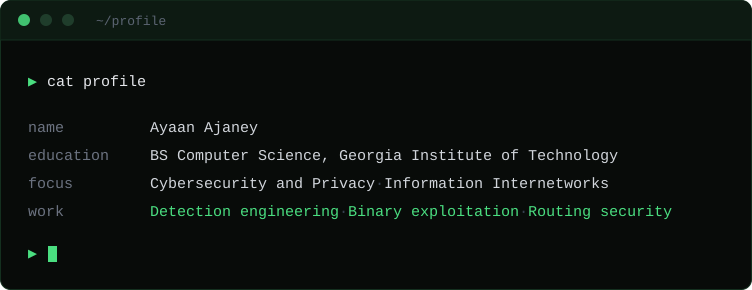
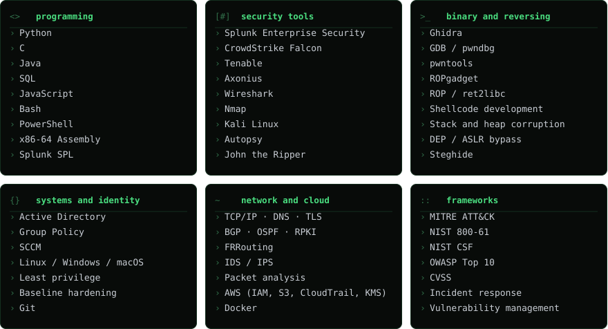

<p align="center">
  
</p>

<p align="center">
  <a href="https://linkedin.com/in/ayaanajaney"></a>
  <a href="mailto:ajaney@gatech.edu"></a>
</p>

<br>

## `$ cat skills.txt`

<p align="center">
  
</p>

<br>

## `$ cat work.txt`

```
[*] detection engineering    Splunk SPL, CrowdStrike Falcon and Active Directory
                             telemetry correlation, MITRE ATT&CK mapping

[*] binary exploitation      stack and heap corruption, ROP chains, ret2libc,
                             defeating stack canaries, DEP and ASLR

[*] routing security         issued RPKI route origin authorizations, deployed
                             origin validation, then built a forged origin
                             hijack that survives it

[*] applied cryptography     length extension, MD5 collision, CBC padding
                             oracle, RSA signature forgery

[*] web exploitation         SQL injection, XSS and CSRF against layered filters
```
